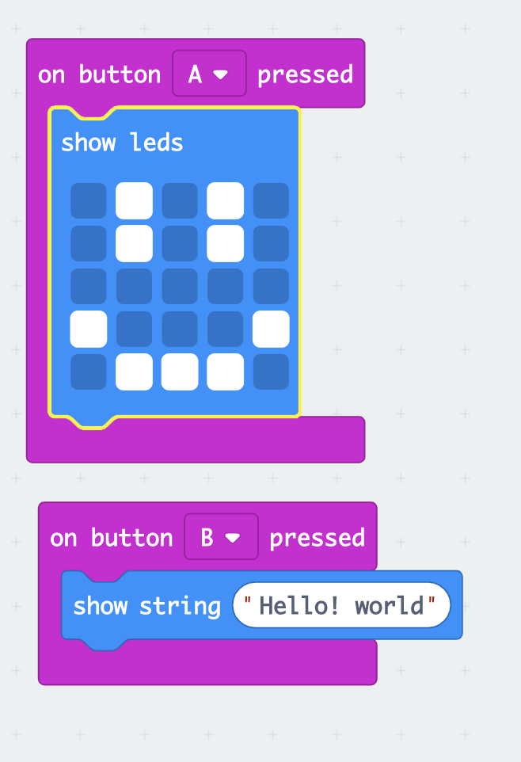

# Inventor Kit Experiments

## Instructions ##

*For a selection of 5 inventor kit experiments that you choose, fill out the following sections.

### Experiment 01 ###

#### Photo of completed project ####
*In the code below, replace `missingimage.png` with the name of the image, which should be in the `kitexperiments` folder.*

(The code what I made in the Microsoft MadeCode)

(This is how the micro-bit works on screen)

#### Reflection ####

This is my first experiment with microbit. I have learned the coding strucuture which describes the switch buttons and LED matrix.SW1 was set as Button A, SW2 was set as Button B. I understand that Edge pin 0V worked as GND pin.
I tried to modified the code in order to change the duration of the LED but I could not find the proper code.

### Experiment 2###

(Dimming a LED using a potentiometer)

#### Photo of completed project ####
In the code below, replace imagemissing.jpg with the name of the image, which should be in the kitexperiments folder.

(Insert a caption here)

#### Reflection ####

This is my first experiment with microbit. I have learned the coding strucuture which describes the button and LED.
I tried to modified the code in order to change the duration, but I could not find the proper code.

### Experiment name ###

(Replace this with the experiment name)

#### Photo of completed project ####
In the code below, replace imagemissing.jpg with the name of the image, which should be in the kitexperiments folder.

(Insert a caption here)

#### Reflection ####

In this experiment, something new to me was or something I learned was (insert something here).

This experiment could be the basis of a real world application such as (insert something here).

### Experiment name ###

(Replace this with the experiment name)

#### Photo of completed project ####
In the code below, replace imagemissing.jpg with the name of the image, which should be in the kitexperiments folder.

(Insert a caption here)

#### Reflection ####

In this experiment, something new to me was or something I learned was (insert something here).

This experiment could be the basis of a real world application such as (insert something here).

### Experiment name ###

(Replace this with the experiment name)

#### Photo of completed project ####
In the code below, replace imagemissing.jpg with the name of the image, which should be in the kitexperiments folder.

(Insert a caption here)

#### Reflection ####

In this experiment, something new to me was or something I learned was (insert something here).

This experiment could be the basis of a real world application such as (insert something here).

