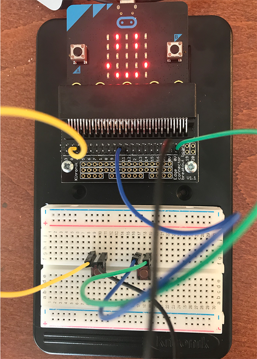
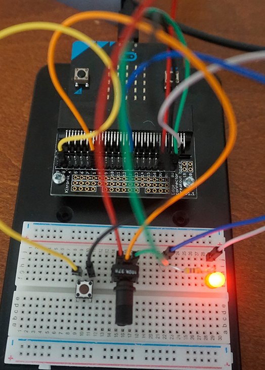
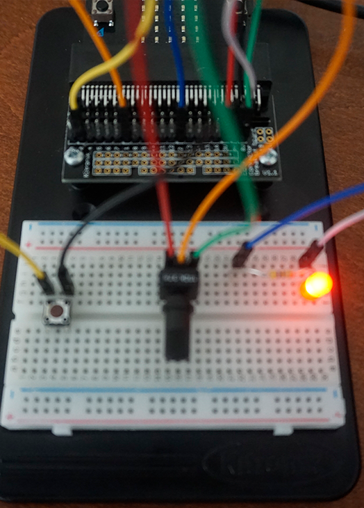
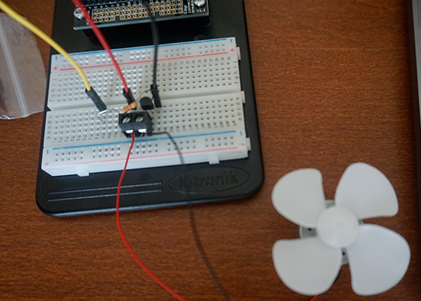
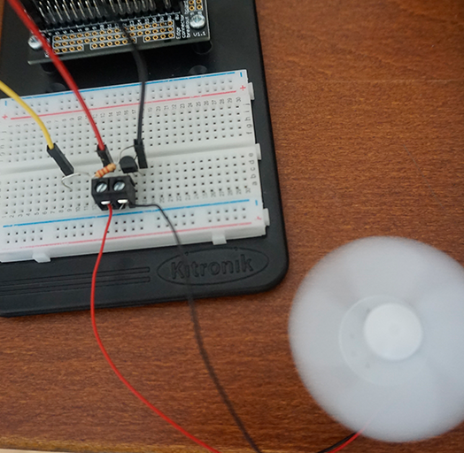
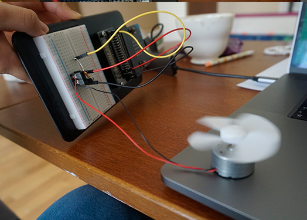

# Inventor Kit Experiments

### Experiment 01 ###

The code what I made in the Microsoft MadeCode

This is how the micro-bit works

#### Reflection ####

This is my first experiment with microbit. I have learned the coding strucuture which describes the switch buttons and LED matrix.SW1 was set as Button A, SW2 was set as Button B. I understand that Edge pin 0V worked as GND pin.
I tried to modified the code in order to change the duration of the LED but I could not find the proper code.

### Experiment 2 ###

## Dimming a LED using a potentiometer ##

#### Photo of completed project ####

The code what I made in the Microsoft MadeCode

(The circuit on the breadboard and how LED worked)

(I moved the S1 switch and sentting of the jump wires.then I confirmed it was still working.)

#### Reflection ####
It was very difficult to find out which was the flatside of the LED. Now I found out that the short leg side is the flat side. Also I have noticed the LED has own light strengh depends on their color. Red has most strong light.
And I struggled to find which is the POT conponent. This was because I had to connect the knob to the POT part. 
Now I have learned the coding and how swith works(ON/OFF). I am not sure How Digital to Analog Converter works. I understand in the code which discribes: analogue write pins to digital write pin.. However, I need to look further.

### Experiment 3 ###

## Using a transister to drive a motor ##

#### Photo of completed project ####

The code what I made in the Microsoft MadeCode

The circuit on the breadboard

Fan was spinning! Slowing down and speeding up!

#### Reflection ####

In this experiment, I learned that the role of transister. Transister could convert weak electrical signals into strong signals, that why the motor could work with Microbit. I am prerry sure transister could be used any situation when I want to create something which has some movement.

### Experiment 4 ###

## Using the accelerometer to control motor speed

#### Photo of completed project ####
In the code below, replace imagemissing.jpg with the name of the image, which should be in the kitexperiments folder.

Fan started moving when accelerometer detect the deirections.

#### Reflection ####

In this experiment, 
This experiment could be the basis of a real world application such as (insert something here).

### Experiment 5 ###

(Replace this with the experiment name)

#### Photo of completed project ####
In the code below, replace imagemissing.jpg with the name of the image, which should be in the kitexperiments folder.

(Insert a caption here)

#### Reflection ####

In this experiment, something new to me was or something I learned was (insert something here).

This experiment could be the basis of a real world application such as (insert something here).

