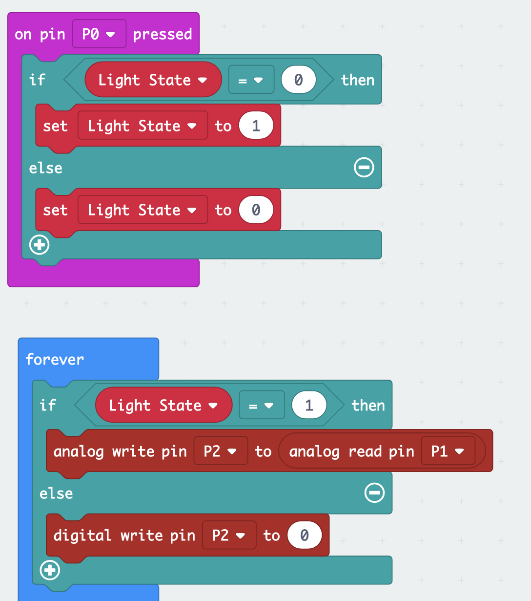
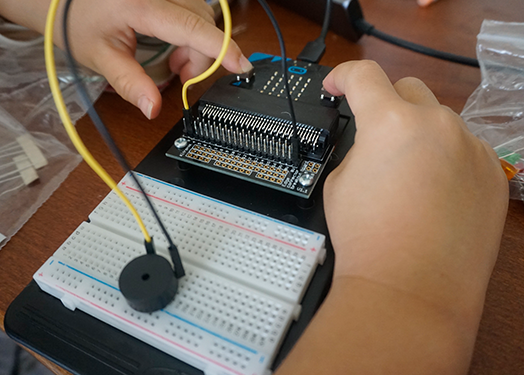
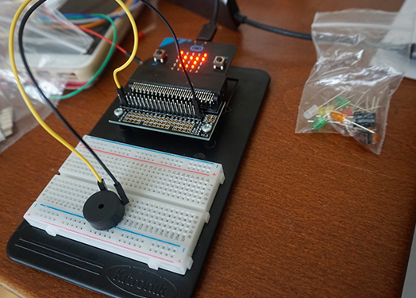
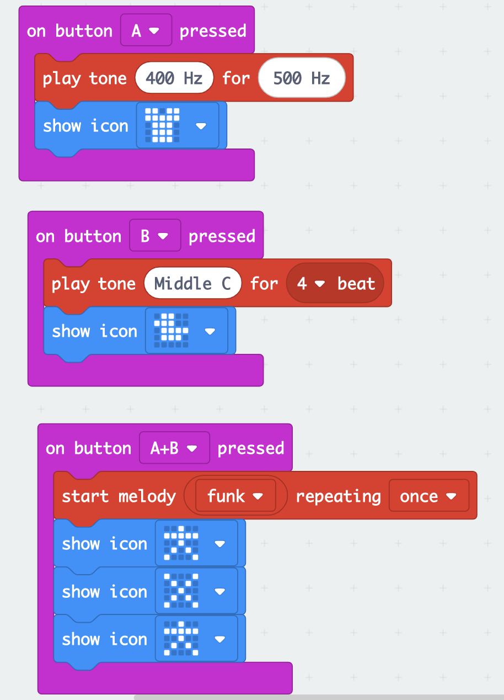
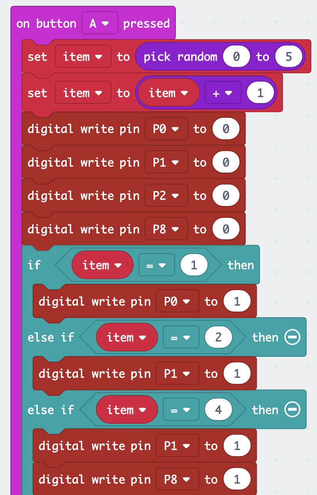
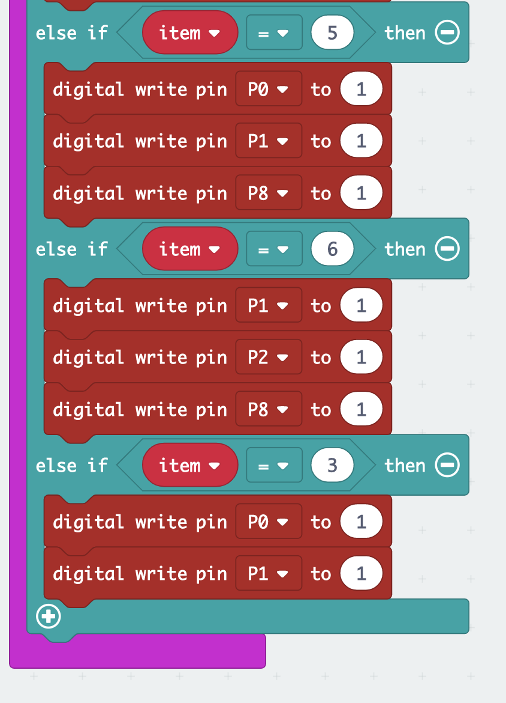
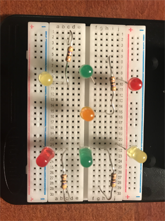
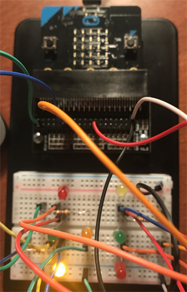
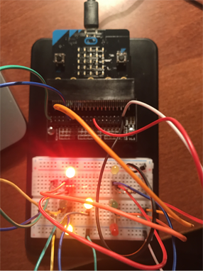

# Inventor Kit Experiments

## Experiment 01 ##
### Say "HELLO" to the BBC micro:bit! ###

The code what I made in the Microsoft MadeCode

This is how the micro-bit works

#### Reflection ####

This is my first experiment with microbit. I have learned the coding strucuture which describes the switch buttons and LED matrix.SW1 was set as Button A, SW2 was set as Button B. I understand that Edge pin 0V worked as GND pin.

I tried to modified the code in order to change the duration of the LED but I could not find the proper code.

## Experiment 2 ##

## Dimming a LED using a potentiometer ##

#### Photo of completed project ####

The code what I made in the Microsoft MadeCode

The circuit on the breadboard and how LED worked

I moved the S1 switch and sentting of the jump wires.then I confirmed it was still working.

#### Reflection ####
It was very difficult to find out which was the flatside of the LED. Now I found out that the short leg side is the flat side. Also I have noticed the LED has own light strengh depends on their color. Red has most strong light.
And I struggled to find which is the POT conponent. This was because I had to connect the knob to the POT part. 
Now I have learned the coding and how swith works(ON/OFF). I am not sure How Digital to Analog Converter works. I understand in the code which discribes: analogue write pins to digital write pin.. However, I need to look further.

## Experiment 3 ##

### Using a transister to drive a motor ###

|The code what I made in the Microsoft MadeCode

|The circuit on the breadboard

|Fan was spinning! Slowing down and speeding up!

#### Reflection ####

In this experiment, I learned that the role of transister. Transister could convert weak electrical signals into strong signals, that why the motor could work with Microbit. I am prerry sure transister could be used any situation when I want to create something which has some movement.

## Experiment 4 ##

### Using the accelerometer to control motor speed ###

#### Reflection ####

Fan started moving when accelerometer detect the deirections.I had no idea about the the structure of 3 dimentions in coding.
(x,y,z..etc) I need to look further about this.

## Experiment 5 ##

### Setting the tone with a piezo buzzer ###

#### Reflection ####

I had playing around with a lot of music patterns. And I set some LED code which links to the switches. Now I am confident of the switch and LED systems. It will be the key factor of my replication project.

### Experiment 6' ###

## To make a dice using seven LEDs. ##
## To use the ‘Pick Random’ number block. ##
|Inventors Kit Experiment 12 Full Experiment|

# Following is my code" #

#### Photo of completed project ####

|The bread board what i made

|Random LED light up when the switch A was pressed #case1

|Random LED light up when the switch A was pressed.#case2
(Insert a caption here)

|In order to confirm the selected number and the number of the LED is same, I set the code to show the number on the microbit display
#### Reflection ####
This was very complecated breadboard structure. I needed 3 tries to complete.  I have learned that the code to set the random number.
