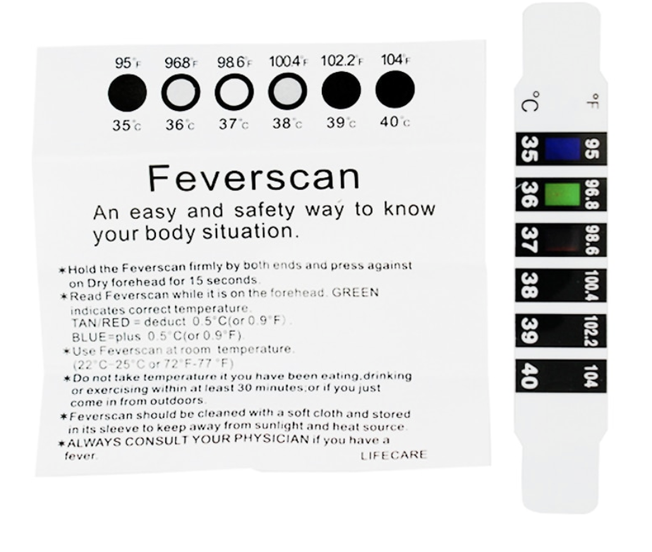
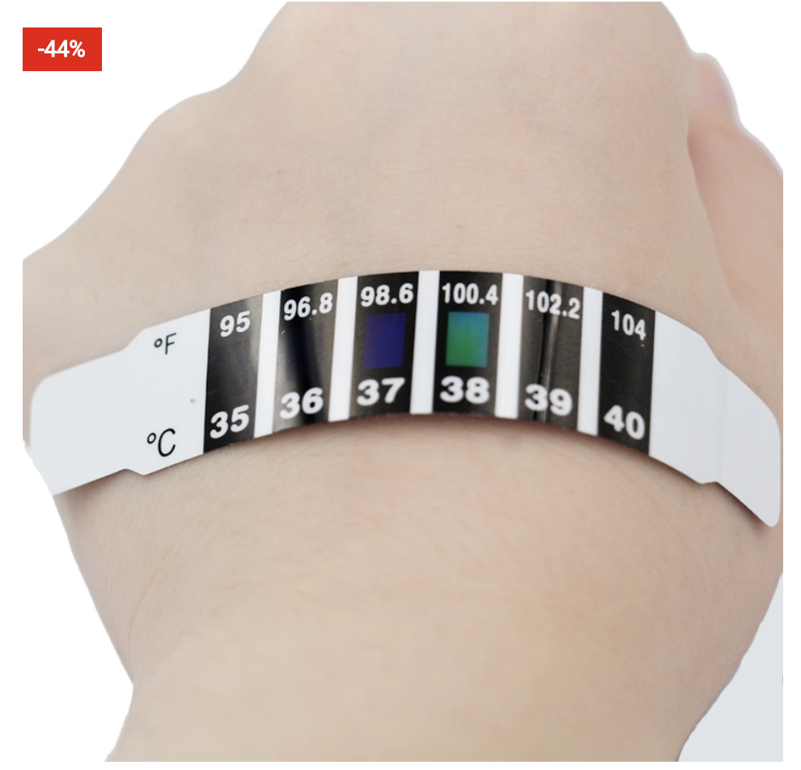
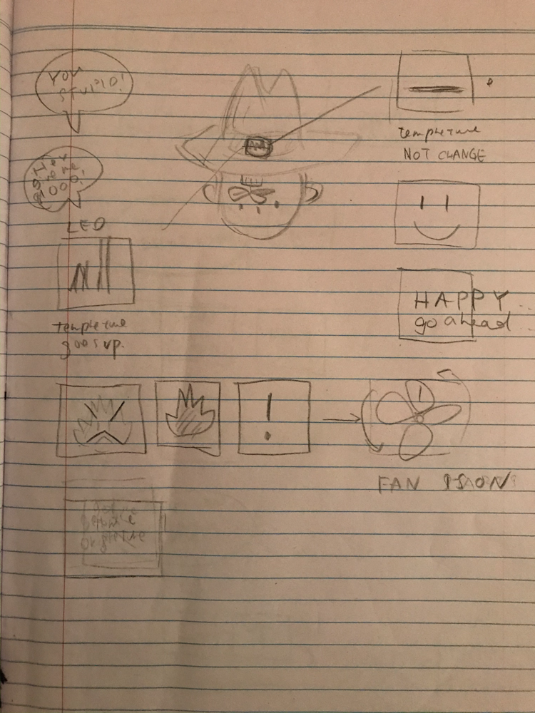
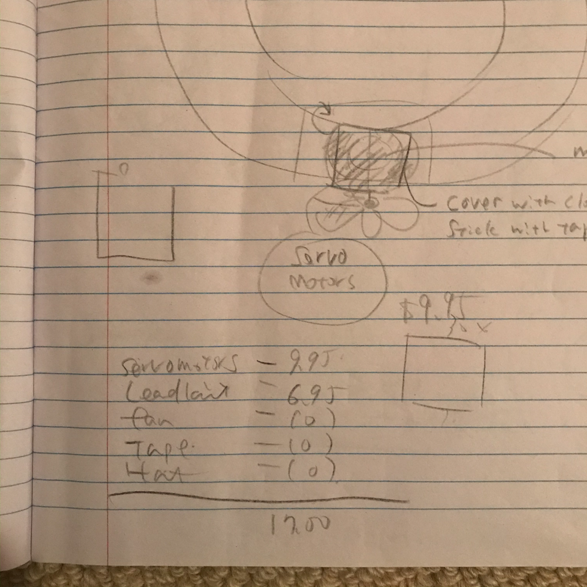
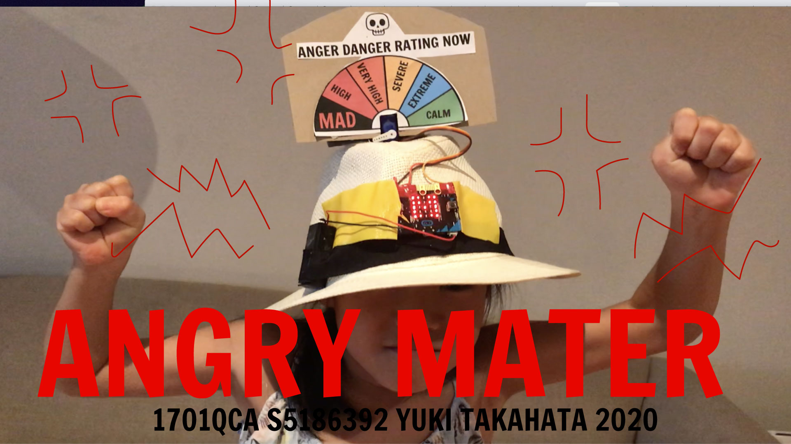
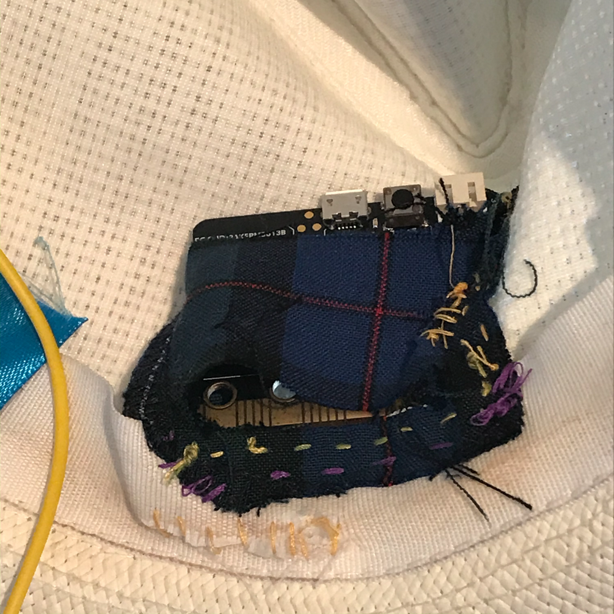
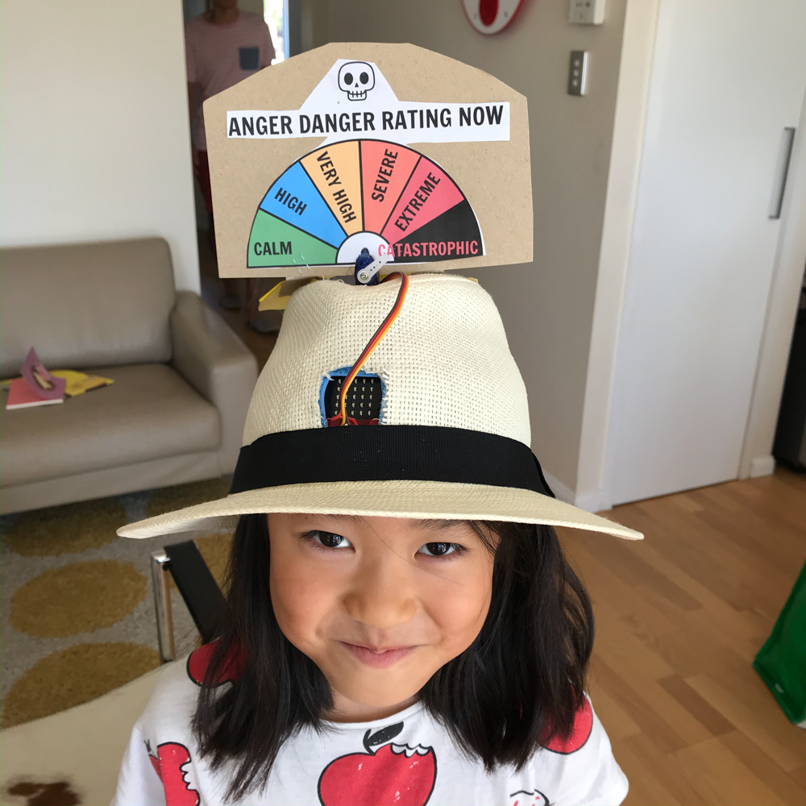
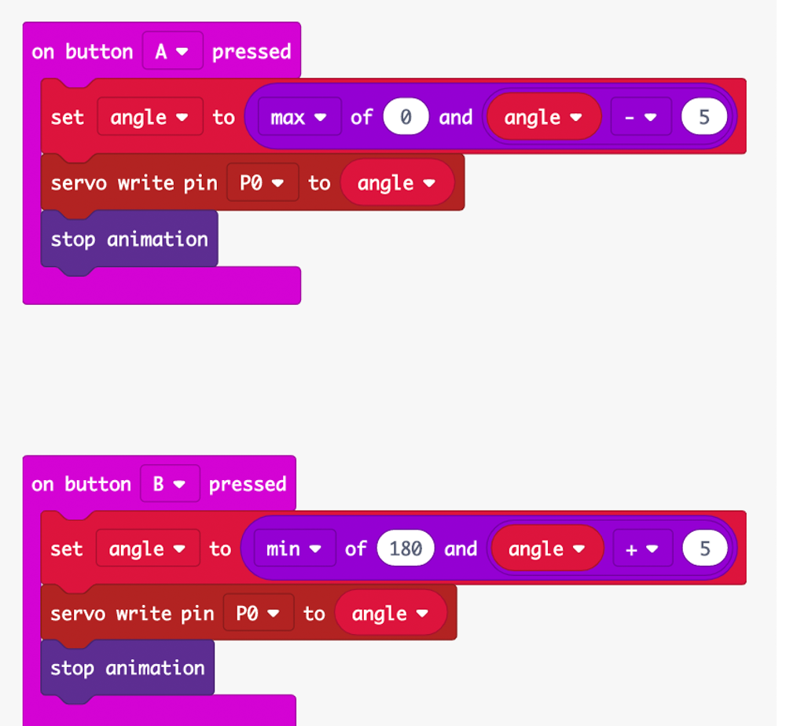
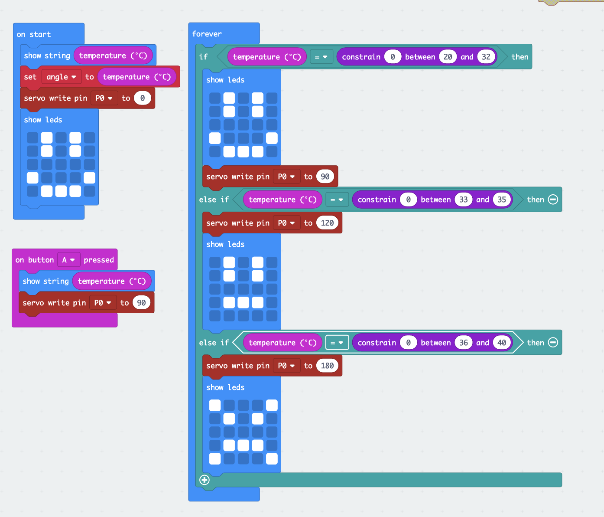

# Assessment 1: Replication project

## Replication project choice ##
(TEMPARETURE GAUGE)

## Related projects ##

### Related project 1 ###
(Honda 3E-A18 Robot)

https://youtu.be/rZ-EzeXdLJo

This project is related to mine because it shows a good example how technologies relates to express the feelings.

### Related project 2 ###
( A cap with propela)

This project is related to mine because, this gave me a idea that how to modify the cap/hat fabrication.

### Related project 3 ###
(Grrr MATER)

<a href="https://tenor.com/view/grr-meter-anger-rage-anger-meter-gif-15697874">Grr Meter GIF</a> from <a href="https://tenor.com/search/grr-gifs">Grr GIFs</a>

This project is related to  mine because this is the function what I wanted to create with the function of tempreture gauge.

### Related project 4 ###
（Head Themometer strip)

This project is related to mine because it is useful to know how to got the accurate human tempreture.

## Reading reflections ##
*Reflective reading is an important part of actually making your reading worthwhile. Don't just read the words to understand what they say: read to see how the ideas in the text fit with and potentially change your existing knowledge and maybe even conceptual frameworks. We assume you can basically figure out what the readings mean, but the more important process is to understand how that changes what you think, particularly in the context of your project.*

*For each of the assigned readings, answer the questions below.*

### Reading: Don Norman, The Design of Everyday Things, Chapter 1 (The Psychopathology of Everyday Things) ###

*What I thought before: Describe something that you thought or believed before you read the source that was challenged by the reading

I just thought it was a concept that I couldn't understand vaguely. However, now  I realise that I didn't understand the range of area which handled by the designers. By incorporating human relationships into the design,I thought there might be countless possibilities.

*What I learned: Describe what you now know or believe as a result of the reading. Don't just describe the reading: write about what changed in YOUR knowledge.*

Signifiers is am important comunication tool, but it could cause misleading.
Natural Maping leads to immediate understanding. I think mapping could work well than Siginifiers when the experience based design。

*What I would like to know more about: Describe or write a question about something that you would be interested in knowing more about.*
I would like to know how analyse the results when verifying the concept model. "Different people may hold different  mental models"

*How this relates to the project I am working on: Describe the connection between the ideas in the reading and one of your current projects or how ideas in the reading could be used to improve your project.*
For this project, I really sticking the hat to being wearable. In terms of use, it is ok, but as a concept, it would be better to examine the two player's gaze　point and phisical movement.

### Reading: Chapter 1 of Dan Saffer, Microinteractions: Designing with Details, Chapter 1 ###

*What I thought before: Describe something that you thought or believed before you read the source that was challenged by the reading.*
I did not know the idea of "Microinteractions" So, it is fun to read to understand the concept. Actually, I often interact with Mincrointeraction many times ,everyday. Even I expect a certain revel of microinteractions in any apps. SO that as a designer, understand the user's expectation is the key.

*What I learned: Describe what you now know or believe as a result of the reading. Don't just describe the reading: write about what changed in YOUR knowledge.*

I have learned the structure of Microinteractions; There is four steps. 
Trigger: User act something, then "Many microinterations begin with an understading of user need"
Rules:determine the function"engages a sequence of behavior"
Feedback: generate rules/Can take any form, can be subtle and ambient
LOOPS and MODES: " make up its meta-rules"

*How this relates to the project I am working on: Describe the connection between the ideas in the reading and one of your current projects or how ideas in the reading could be used to improve your project.*

"reduce a complicated feature to a core microinteraction" ; makes the project simple, straightforward, and impactful.

### Reading: Scott Sullivan, Prototyping Interactive Objects ###

*What I thought before: Describe something that you thought or believed before you read the source that was challenged by the reading.*

I have never thought that I could make something "whole new dimension of product design"!

*What I learned: Describe what you now know or believe as a result of the reading. Don't just describe the reading: write about what changed in YOUR knowledge.*

The useful parts anf information source and security issues around this area of study.Firmata/Ardino Fio/Xbee/jst plug/ privacy issues/

*What I would like to know more about: Describe or write a question about something that you would be interested in knowing more about.*

I would like to know how to get the proper electricity without bad look!

## Interaction flowchart ##

### COST ###

## Process documentation

- We need 2 people
- People A will tell a bad word and swear to People B
- People B will wear the hat.

1. B wears the hat
2. Hat's swicth on
3. Sensor gets the room temprature
4. A starts to swear B( keeping on)
5. Sensor getsB's body tempreture
6. LED shows the change of the temprature 
7. Gauge meter keep going up to "MAD"
8. B will surprised that his/her body tempreture goes up with just few bad words!

## Project outcome ##

### ANGRY MATER ###

### Project description ###

*This hat tricks people who are wearing this hat.
Once a tester is wearing the hat, the moderator tells several unpleasant sentences to the tester. Tester is getting furious, and the gauge shows how angry the tester is.
The system is;
1. Microbit gets the room temperature when the switch is on( average 25-32 in Gold Coast)
2. A tester wearing the hat, microbit gets the tester's body temperature, other than the room temperature. The average body temperature is around 36-37. 
3. The gauge shows the tester is MAD!! and the tester would be in more confusion!*

### Showcase image ###

<iframe width="560" height="315" src="https://www.youtube.com/embed/ewtYk0vmaks" frameborder="0" allow="accelerometer; autoplay; encrypted-media; gyroscope; picture-in-picture" allowfullscreen></iframe>

### Reflection ###

### OUTFIT ###

* I regret that I planned this hat to be portable.Therefore I could not use bread board, so the servo motor is the maximum function which I could add to this project. If I could you the bread boad, These hat can be more fun with sounds, fun, light etc.

Also I regret that I could not get the proper pins from the shop as I am in self isolation. 
The lack of the knowledge put me in war with electric wires. In very early stage, I connected the servo motor via an alligator plug, and a male to female wire to Microbit.(as follow as youtube tutrial) However,the motor did not work well.Then I decided to cut off the wire . This was the startpoint of my nightmare.

Then I connect the end of wire into each aligator pins.

The fabilcation of the hat was very difficult and very unstable. I should have had to choose more solid one.
I needed to create the case for Microbit because it has to stay inside the hat in order to get the body tempreture. 
Firstly, I select the fabric to saw the case for microbit, This was simply because it was easy to attach to the hat. However it was too soft to hold microbit.

Then, I chose a soft form, I think it was a good choice. Cut and fix very easily.

But inside of the hat is very messy..

This is the FINAL OUT FIT

### CODE ###

To confirm the servo motor　works well with this setting,

Now it works!

I set the range of temparatures:and I also tried to control the servo motor accurately which could relate to the real body temprature. but it is little bit complecated . so I gave up.
!

*Describe the parts of your project you felt were most successful and the parts that could have done with improvement, whether in terms of outcome, process, or understanding.*

I really would like to use more powerful servo motors to create more active movement around the hat, if I could have an opppotunity to improve. Even it seemed the needle of the scale was bit heavy for this servo motor.

*What techniques, approaches, skills, or information did you find useful from other sources (such as the related projects you identified earlier)?*

I have checked 
-Microbit information( mapping of the sensor)
-how the servo motor moves-
-How to connect the wire with Alligator pins.

*What ideas have you read, heard, or seen that informed your thinking on this project? (Provide references.)*

*What might be an interesting extension of this project? In what other contexts might this project be used?*
This hat could be transformed into the interectual game with souds and movements.
