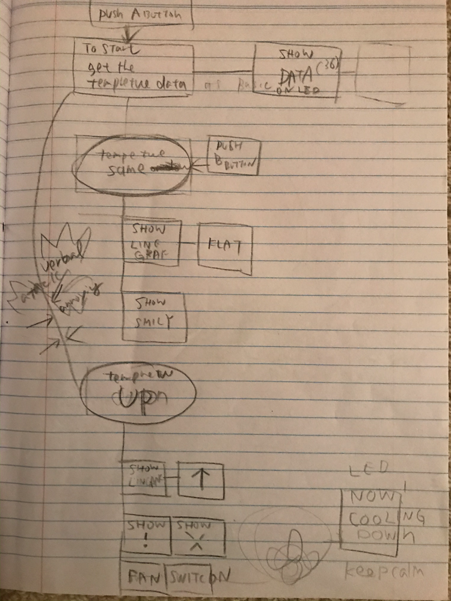
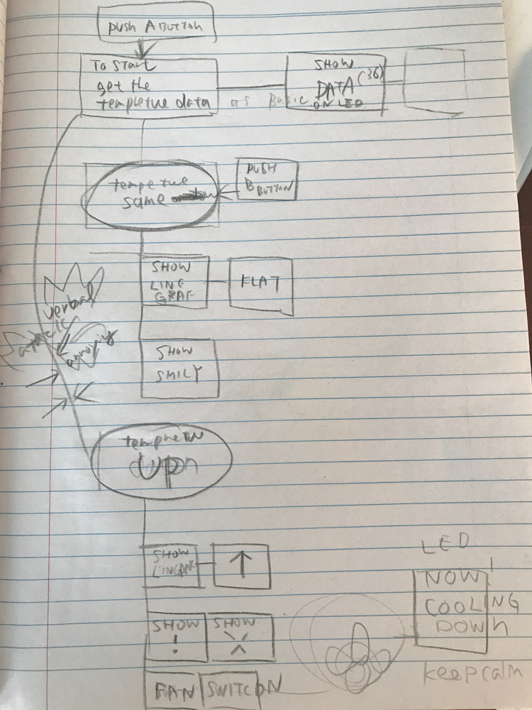
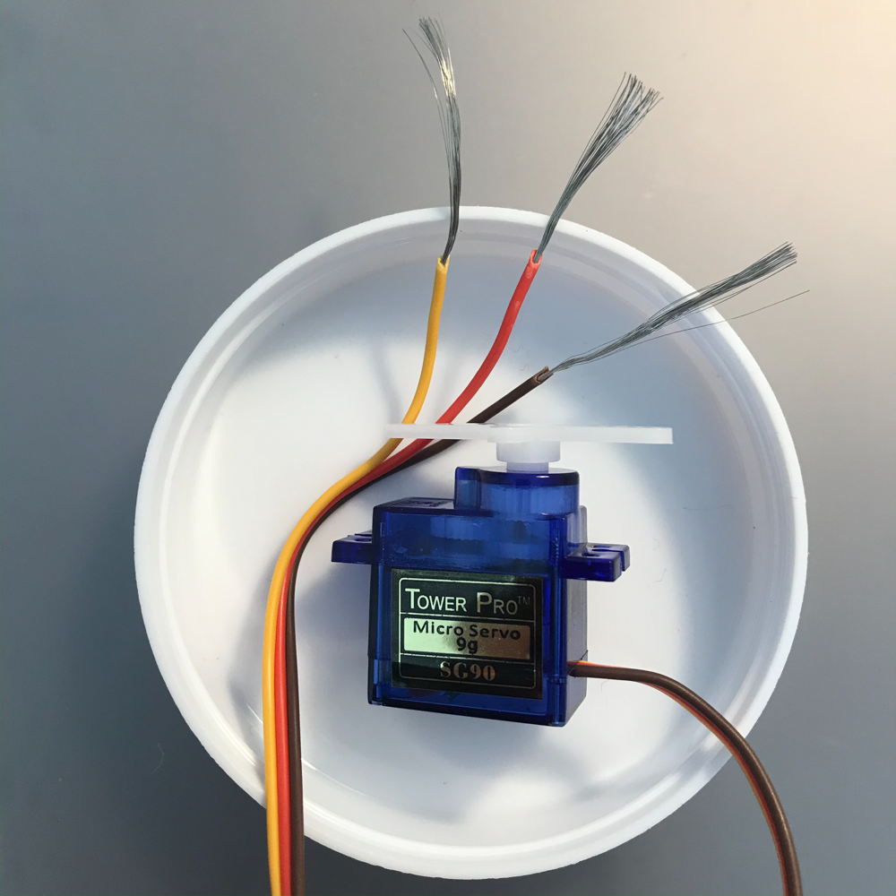
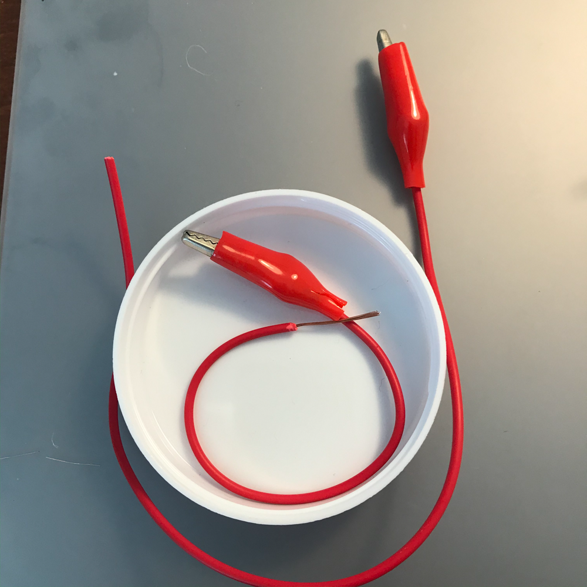
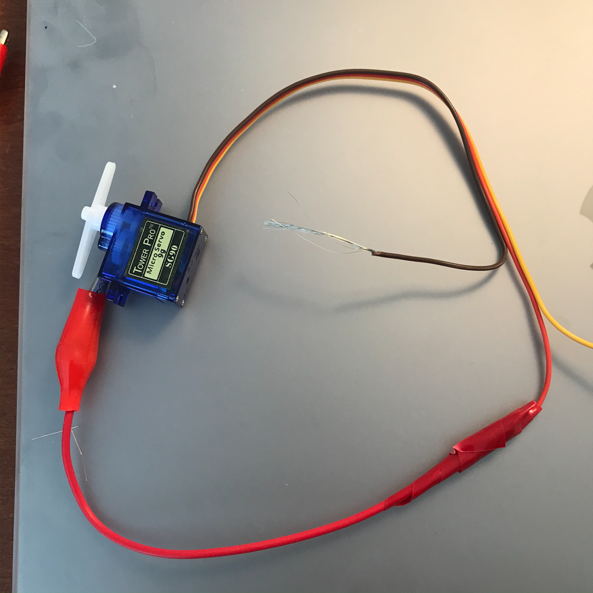
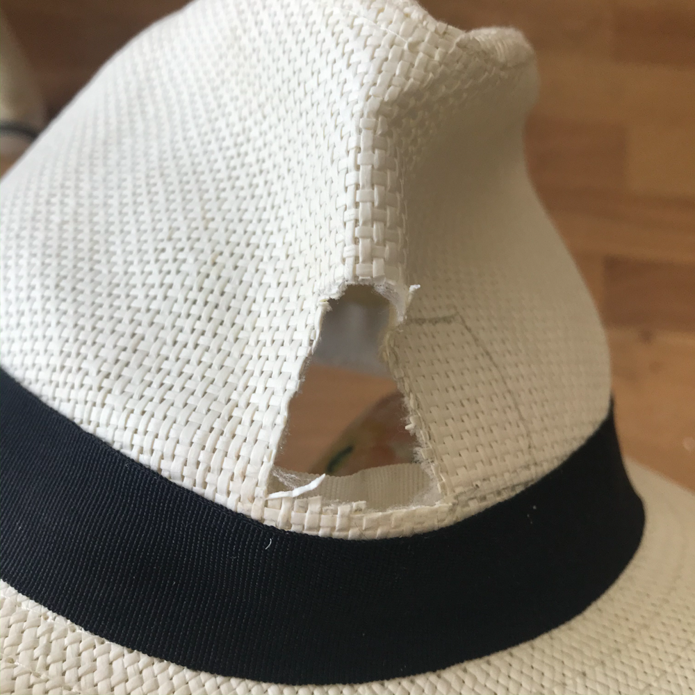
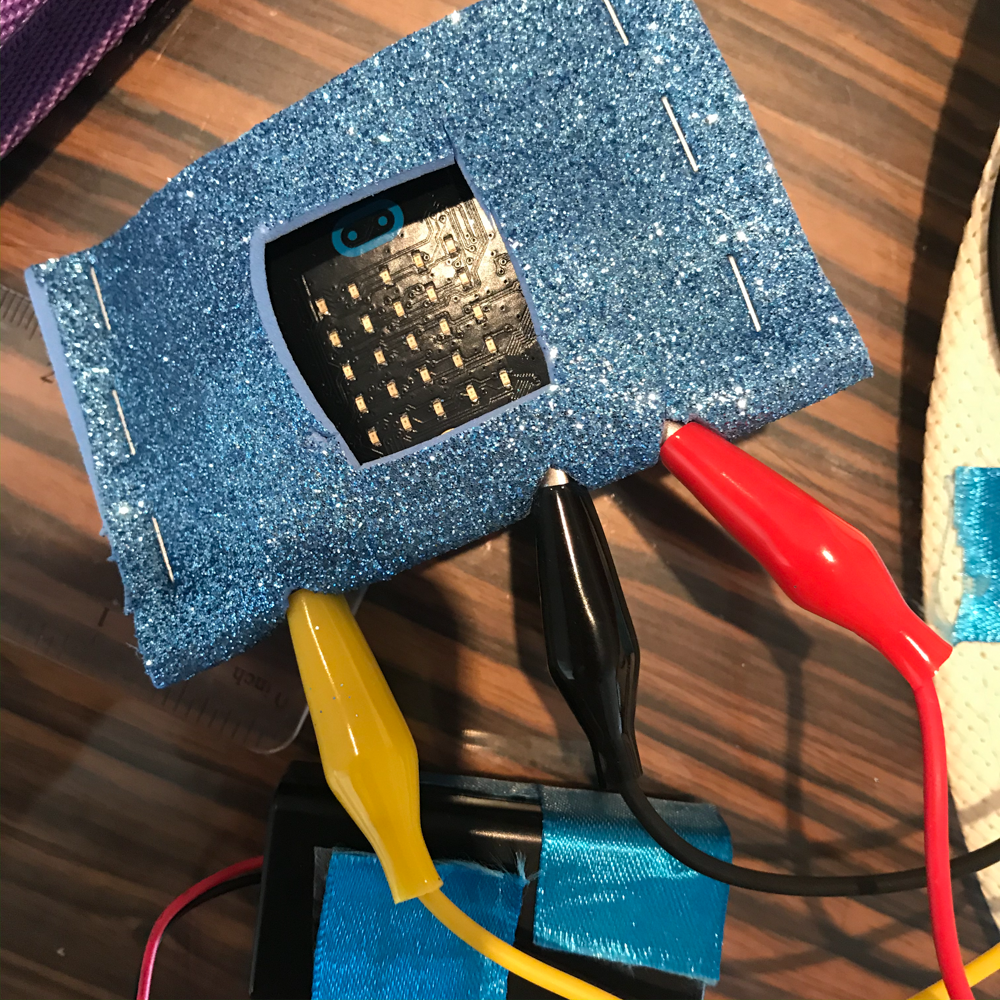
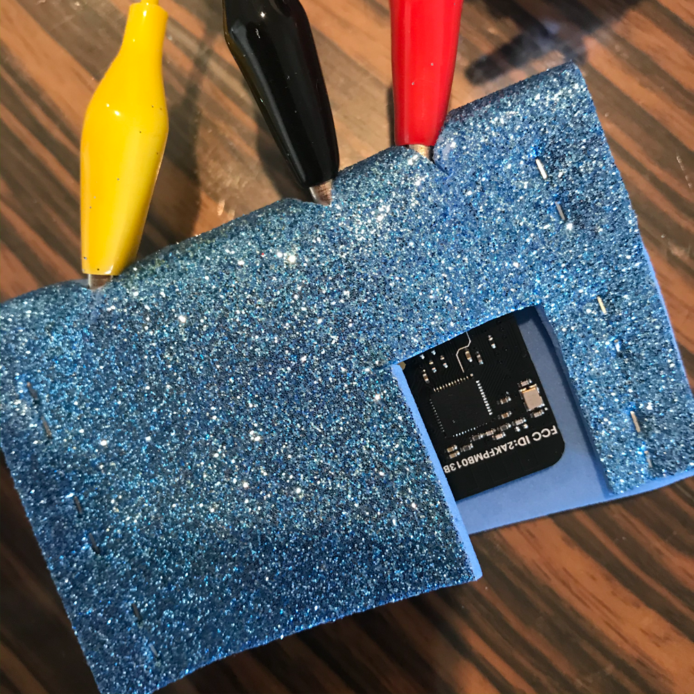
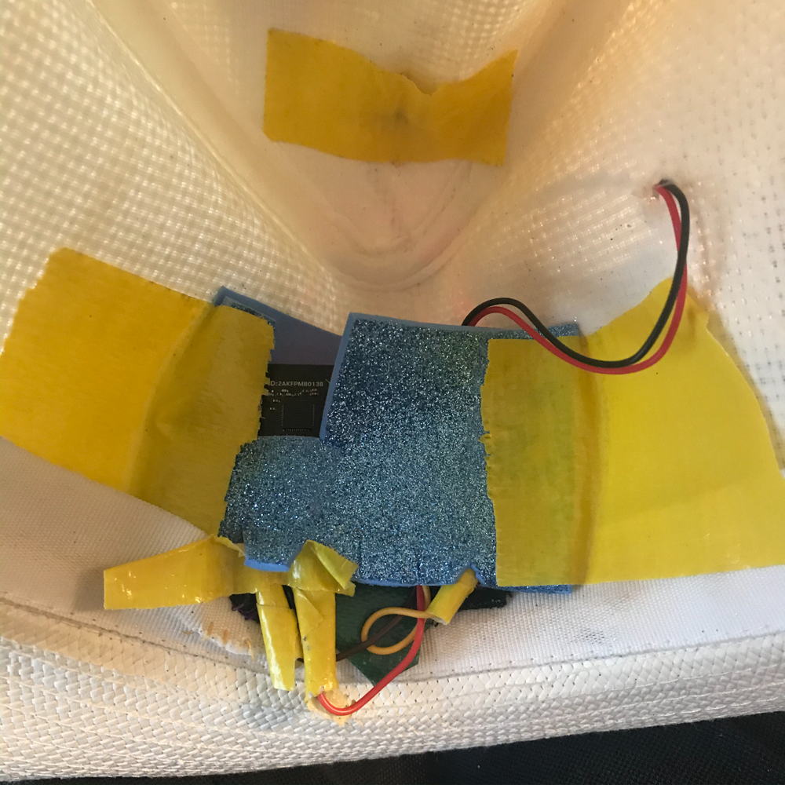

# Assessment 1: Replication project

## Replication project choice ##
(TEMPARETURE GAUGE)

## Related projects ##
*Find about 6 related projects to the project you choose. A project might be related through  function, technology, materials, fabrication, concept, or code. Don't forget to place an image of the related project in the* `replicationproject` *folder and insert the filename in the appropriate places below. Copy the markdown block of code below for each project you are showing, updating the number* `1` *in the subtitle for each.*

### Related project 1 ###
(Honda 3E-A18 Robot)

https://youtu.be/rZ-EzeXdLJo

This project is related to mine because it shows how to express the feelings with the technologies.

### Related project 2 ###
( A cap with propela)
![Image]
This project is related to mine because, this gave me a idea that how to modify the cap/hat.

### Related project 3 ###
(Grrr MATER)

<a href="https://tenor.com/view/grr-meter-anger-rage-anger-meter-gif-15697874">Grr Meter GIF</a> from <a href="https://tenor.com/search/grr-gifs">Grr GIFs</a>

This project is related to  mine because this is the function what I wanted to create with the function of tempreture gauge.

### Related project 4 ###
（Head Themometer strip)
 ###

*What I thought before: Describe something that you thought or believed before you read the source that was challenged by the reading.*

*What I learned: Describe what you now know or believe as a result of the reading. Don't just describe the reading: write about what changed in YOUR knowledge.*

*What I would like to know more about: Describe or write a question about something that you would be interested in knowing more about.*

*How this relates to the project I am working on: Describe the connection between the ideas in the reading and one of your current projects or how ideas in the reading could be used to improve your project.*

### Reading: Chapter 1 of Dan Saffer, Microinteractions: Designing with Details, Chapter 1 ###

*What I thought before: Describe something that you thought or believed before you read the source that was challenged by the reading.*

*What I learned: Describe what you now know or believe as a result of the reading. Don't just describe the reading: write about what changed in YOUR knowledge.*

*What I would like to know more about: Describe or write a question about something that you would be interested in knowing more about.*

*How this relates to the project I am working on: Describe the connection between the ideas in the reading and one of your current projects or how ideas in the reading could be used to improve your project.*

### Reading: Scott Sullivan, Prototyping Interactive Objects ###

*What I thought before: Describe something that you thought or believed before you read the source that was challenged by the reading.*

*What I learned: Describe what you now know or believe as a result of the reading. Don't just describe the reading: write about what changed in YOUR knowledge.*

*What I would like to know more about: Describe or write a question about something that you would be interested in knowing more about.*

*How this relates to the project I am working on: Describe the connection between the ideas in the reading and one of your current projects or how ideas in the reading could be used to improve your project.*

## Interaction flowchart ##
*Draw a flowchart of the interaction process in your project. Make sure you think about all the stages of interaction step-by-step. Also make sure that you consider actions a user might take that aren't what you intend in an ideal use case. Insert an image of it below. It might just be a photo of a hand-drawn sketch, not a carefully drawn digital diagram. It just needs to be legible.*

## Process documentation

*In this section, include text and images that represent the development of your project including sources you've found (URLs and written references), choices you've made, sketches you've done, iterations completed, materials you've investigated, and code samples. Use the markdown reference for help in formatting the material.*

*This should have quite a lot of information!*

*There will likely by a dozen or so images of the project under construction. The images should help explain why you've made the choices you've made as well as what you have done. Use the code below to include images, and copy it for each image, updating the information for each.*

*Include screenshots of the code you have used.*

## Project outcome ##

### ANGRY MATER ###

### Project description ###

*This hat tricks people who are wearing this hat.
Once a tester is wearing the hat, the moderator tells several unpleasant sentences to the tester. Tester is getting furious, and the gauge shows how angry the tester is.
The system is;
1. Microbit gets the room temperature when the switch is on( average 25-32 in Gold Coast)
2. A tester wearing the hat, microbit gets the tester's body temperature, other than the room temperature. The average body temperature is around 36-37. 
3. The gauge shows the tester is MAD!! and the tester would be in more confusion!*

### Showcase image ###

*Try to capture the image as if it were in a portfolio, sales material, or project proposal. The project isn't likely to be something that finished, but practice making images that capture the project in that style.*

### Additional view ###

*Provide some other image that gives a viewer a different perspective on the project such as more about how it functions, the project in use, or something else.*

### Reflection ###

* I regret that I planned this hat to be portable.Therefore I could not use bread board, so the servo motor is the maximum function which I could add to this project. If I could you the bread boad, These hat can be more fun with sounds, fun, light etc.

Also I regret that I could not get the proper pins from the shop as I am in self isolation. 
The lack of the knowledge put me in war with electric wires. In very early stage, I connected the servo motor via an alligator plug, and a male to female wire to Microbit.(as follow as youtube tutrial) However,the motor did not work well.Then I decided to cut off the wire . This was the startpoint of my nightmare.

Then I connect the end of wire into each aligator pins.

The fabilcation of the hat was very difficult and very unstable. I should have had to choose more solid one.
I needed to create the case for Microbit because it has to stay inside the hat in order to get the body tempreture. 
Firstly, I select the fabric to saw the case for microbit, This was simply because it was easy to attach to the hat. However it was too soft to hold microbit.

Then, I chose a soft form, I think it was a good choice. Cut and fix very easily.

But inside of the hat is very messy..

This is the out

*Describe the parts of your project you felt were most successful and the parts that could have done with improvement, whether in terms of outcome, process, or understanding.*

*What techniques, approaches, skills, or information did you find useful from other sources (such as the related projects you identified earlier)?*

*What ideas have you read, heard, or seen that informed your thinking on this project? (Provide references.)*

*What might be an interesting extension of this project? In what other contexts might this project be used?*
